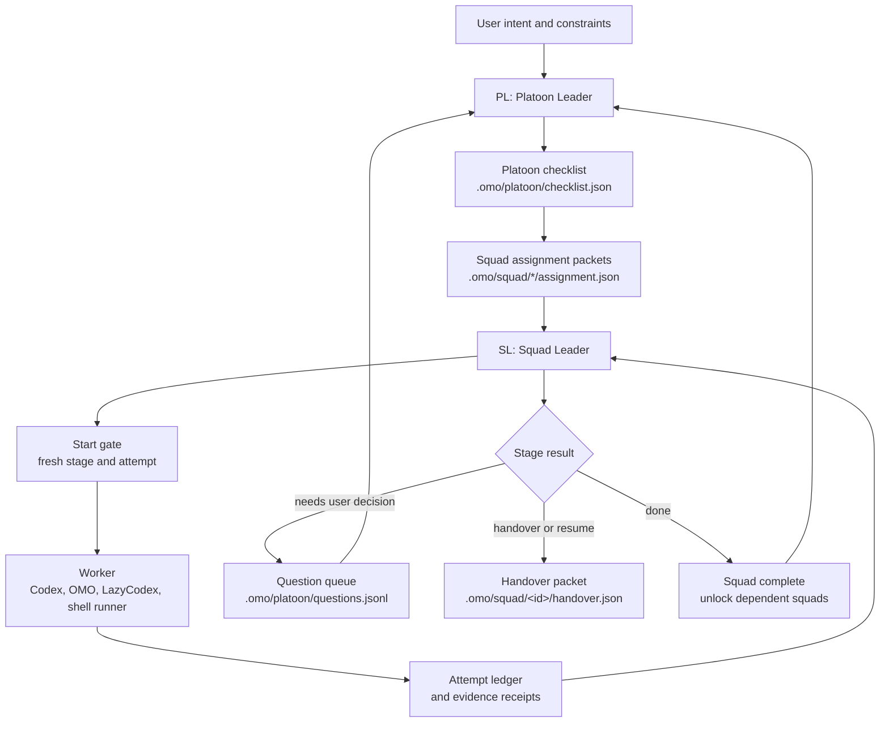

<h1 align="center">MARSHAL</h1>

<p align="center">
  <strong>Control-plane first orchestration for Codex agents.</strong><br>
  <em>A Python CLI and Codex plugin surface for platoon/squad dispatch, handover, evidence, and continuation.</em>
</p>

<p align="center">
  
  
  
  
  
</p>

<p align="center">
  <sub><em>Marshal is not a model and not an OMO fork. It is the orchestration authority: Codex, OMO, LazyCodex, shell runners, and future harnesses are execution substrates.</em></sub>
</p>

```text
███    ███  █████  ██████  ███████ ██   ██  █████  ██
████  ████ ██   ██ ██   ██ ██      ██   ██ ██   ██ ██
██ ████ ██ ███████ ██████  ███████ ███████ ███████ ██
██  ██  ██ ██   ██ ██   ██      ██ ██   ██ ██   ██ ██
██      ██ ██   ██ ██   ██ ███████ ██   ██ ██   ██ ███████
```

---

## Public Surface

Marshal has two entry points:

| Surface | Use it for | Boundary |
|---|---|---|
| Shell CLI | Creating platoons, routing squad stages, dispatching work, recording evidence, producing handovers. | Writes only under the caller-provided artifact root. |
| Codex plugin | Injecting live squad status and continuing active work through `UserPromptSubmit`, `Stop`, and `SubagentStop` hooks. | Calls the installed `marshal` CLI on `PATH`; it does not vendor a Python runtime. |

The public workflow is intentionally small:

```text
init -> state init -> start-gate -> dispatch/run-start-work -> evidence -> complete/handover
```

| Command | Use it for | Output |
|---|---|---|
| `marshal init` | Create the platoon checklist and squad assignment packets. | `.omo/platoon/checklist.json` and `.omo/squad/*/assignment.json` |
| `marshal state init` | Create one squad state artifact from its assignment packet. | `.omo/squad/<id>/state.json` |
| `marshal start-gate` | Record a handover-lite/start gate pass for the current stage and attempt. | `.omo/squad/<id>/start-gate.json` |
| `marshal status` | Show the live platoon and every squad's stage, attempt, gate, and dependency status. | JSON |
| `marshal next` | Print runnable squads ordered by dependency waves. | JSON |
| `marshal run-start-work` | Invoke an external start-work runner for one gated squad. | Runner result plus ledger append |
| `marshal dispatch` | Dependency-gated `run-start-work`; auto-selects the next runnable squad when omitted. | Dispatch result |
| `marshal handover` | Build a complete packet for the next agent. | `.omo/squad/<id>/handover.json` |
| `marshal evidence check` | Verify active-attempt evidence paths exist. | JSON and exit status |
| `marshal complete` | Record an evidence-backed done claim and unlock dependent squads. | State transition plus ledger append |
| `marshal abort` | Stop one active squad or all active squads with a reason. | Abort state plus ledger append |
| `marshal conversation` | Queue, list, and answer user-facing questions. | `.omo/platoon/questions.jsonl` |
| `marshal hook` | Codex hook entry points owned by Marshal. | Codex hook JSON or empty stdout |

## Architecture

```text
operator / Codex session
  -> marshal CLI
    -> platoon checklist
    -> squad assignment + state
    -> start gate
    -> active-attempt ledger
    -> evidence receipts + handover packets

Codex hook
  -> marshal-codex plugin
    -> marshal hook user-prompt-submit
    -> marshal hook stop
    -> marshal hook subagent-stop
```

Marshal is stage/attempt centric. A worker is not considered safely active
because a checkbox exists; it must have a live squad state, a fresh start gate,
and an active attempt ledger.

## PL-SL Workflow

PL means Platoon Leader. SL means Squad Leader. PL owns user intent, dependency
waves, and cross-squad decisions. Each SL owns one squad's assignment, stage,
start gate, active attempt, evidence, and handover.



## Install

Install the CLI first. The Codex hooks call `marshal` directly, so it must be on
`PATH`.

```bash
uv tool install git+https://github.com/contiloop/marshal.git
marshal --version
```

Install the Codex plugin from the GitHub marketplace root:

```bash
codex plugin marketplace add contiloop/marshal --ref main
codex plugin add marshal@marshal
```

For local development:

```bash
git clone https://github.com/contiloop/marshal.git
cd marshal
uv tool install .
codex plugin marketplace add "$PWD"
codex plugin add marshal@marshal
```

You can also register only the plugin subdirectory:

```bash
codex plugin marketplace add /path/to/marshal/codex-plugin
codex plugin add marshal@marshal
```

## Quick Start

```bash
QA_ROOT=$(mktemp -d /tmp/marshal-demo.XXXXXX)
mkdir -p "$QA_ROOT/.omo/plans"
printf '# squad-a plan\n\n## TODOs\n- [ ] Ship cache\n' > "$QA_ROOT/.omo/plans/squad-a.md"

marshal init \
  --root "$QA_ROOT" \
  --goal "Ship cache and dashboard" \
  --scope "squad-a|Redis cache|-" \
  --scope "squad-b|Admin dashboard|squad-a"

marshal state init --root "$QA_ROOT" --squad squad-a --plan ".omo/plans/squad-a.md"
marshal start-gate --root "$QA_ROOT" --squad squad-a --source plan --example ".omo/plans/squad-a.md" --plan ".omo/plans/squad-a.md"
marshal status --root "$QA_ROOT"
marshal next --root "$QA_ROOT"
marshal handover --root "$QA_ROOT" --squad squad-a
```

Inside a Codex session with the plugin installed, the hooks do the same
control-plane work:

| Codex event | Command | Behavior |
|---|---|---|
| `UserPromptSubmit` | `marshal hook user-prompt-submit` | Injects live platoon/squad status as `additionalContext`; silent when no platoon exists. |
| `Stop` | `marshal hook stop` | Blocks to continue a fresh-gated active squad; silent otherwise. |
| `SubagentStop` | `marshal hook subagent-stop` | Same continuation gate after a subagent returns. |

Hooks are quiet by contract. Malformed input, missing `cwd`, no platoon,
`stop_hook_active`, or context-pressure transcripts yield empty stdout and exit
0 so Marshal never crashes Codex.

## End-To-End Workflow

The `--scope` format is:

```text
<squad-id>|<goal>|<depends_csv_or_->
```

Exact development workflow commands:

```bash
QA_ROOT=$(mktemp -d /tmp/marshal-task9-happy.XXXXXX)
mkdir -p "$QA_ROOT/.omo/plans"
printf '# squad-a work plan\n' > "$QA_ROOT/.omo/plans/squad-a.md"

uv run marshal init --root "$QA_ROOT" --goal "Ship cache and dashboard" --scope "squad-a|Redis cache|-" --scope "squad-b|Admin dashboard|squad-a"
uv run marshal state init --root "$QA_ROOT" --squad squad-a --plan ".omo/plans/squad-a.md"
uv run marshal start-gate --root "$QA_ROOT" --squad squad-a --source assignment --example "If design flaw appears, route to plan."
uv run marshal route --root "$QA_ROOT" --squad squad-a --source work --type design_flaw --detail "unexpected dependency" --finding "plan missing dependency edge"
uv run marshal start-gate --root "$QA_ROOT" --squad squad-a --source plan --example "If plan restarts, verify attempt 2 before work."
uv run marshal ledger latest --root "$QA_ROOT" --squad squad-a
uv run marshal delegate-start-work --root "$QA_ROOT" --squad squad-a
```

## Manual Mode Vs Adapter Mode

Marshal does not import or copy OMO/LazyCodex internals.

| Mode | Command | Meaning |
|---|---|---|
| Manual | `marshal delegate-start-work` | Print the start-work command and JSON payload. **start-work is emitted, not invoked**: Marshal hands you the packet and stops at the boundary. |
| Adapter | `marshal run-start-work` | Pipe the same payload to an external runner from `--runner` or `MARSHAL_START_WORK_RUNNER`. Marshal records the dispatch result. |
| Dependency-gated adapter | `marshal dispatch` | Run adapter mode only when dependencies and the start gate allow it. |

## Artifact Map

| Path | Meaning |
|---|---|
| `.omo/platoon/checklist.json` | Platoon goal, squad list, and dependency waves. |
| `.omo/platoon/questions.jsonl` | Serialized user-facing question queue. |
| `.omo/squad/<id>/assignment.json` | Squad scope and dependency assignment. |
| `.omo/squad/<id>/state.json` | Current stage, active attempt, plan pointer, branch/worktree metadata. |
| `.omo/squad/<id>/start-gate.json` | Fresh handover-lite/start gate for the current stage and attempt. |
| `.omo/squad/<id>/ledger.jsonl` | Append-only active-attempt event ledger. |
| `.omo/squad/<id>/handover.json` | Self-contained handover packet for the next agent. |

## Relationship To OMO And LazyCodex

Marshal is the control-plane. OMO/LazyCodex can still be useful as execution
substrates, reference implementations, or optional runners, but Marshal-led
plans should not rely on OMO being the orchestration owner.

When OMO is also installed in the same Codex session, make sure only one surface
owns continuation for a given plan. The clean shape is:

```text
marshal-codex owns Marshal-managed plans
OMO/LazyCodex own their own Boulder/start-work plans
```

## Development

Runtime dependencies are intentionally empty. Development tools are managed with
`uv`.

```bash
uv run pytest
uv run ruff check .
uv run ruff format --check .
uv run basedpyright
```

Release-readiness smoke for the Codex plugin:

```bash
home=$(mktemp -d /tmp/marshal-codex-home.XXXXXX)
CODEX_HOME="$home" codex plugin marketplace add "$PWD"
CODEX_HOME="$home" codex plugin add marshal@marshal
CODEX_HOME="$home" codex plugin list --json --marketplace marshal
```

## License

Marshal is MIT licensed.
